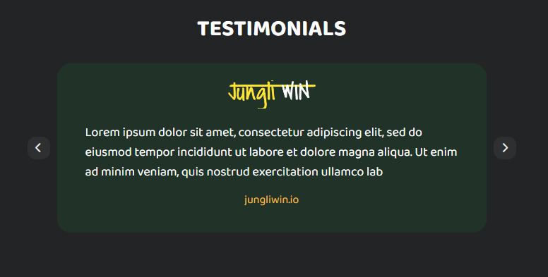

# 50-crowns (real order)

###[Here you can check it](https://artemuholkov.github.io/50-crowns/)

---

I had figma design for this project.
This landing page is 100% responsive for all types of screens.
I used HTML, CSS, JS in this project.

---

###What was interesting in this project:

1. This landing page had multiple hard structured sections like this one:


2. Full screen mobile menu, where burger icon slowly changing to X mark. I did it before, but not in real ordered project.


3. Slider. I used SwiperSlider in this project.
   Connected using CDN.



```
 <script>
      var swiper = new Swiper('.mySwiper', {
        navigation: {
          nextEl: '.swiper-button-next',
          prevEl: '.swiper-button-prev',
        },
        loop: true,
        autoplay: {
          delay: 3000,
        },
      });
    </script>
```

4. It was first time I worked with SVG code to add icons hover effects.


---
